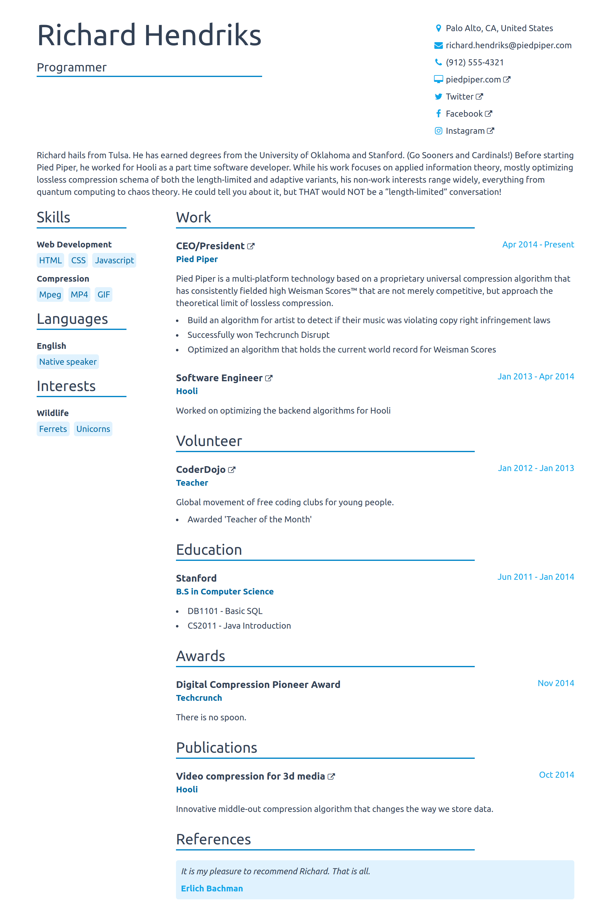

# Autumn Theme for JSON Resume

This is the Sky theme for the [JSON Resume](https://jsonresume.org/) project. It is a fork of the [Autumn Theme](https://github.com/lorenzodalaqua/jsonresume-theme-autumn) by Lorenzo Dal'Aqua. The theme is built using [Tailwind CSS](https://tailwindcss.com/).

## Development / Extension

The theme is built using Gulp for compiling handlebars templates and Tailwind CSS.

To customize this theme or use this as a template to write your own you will need node.js and NPM installed on your system.

Clone this repository, install the dependencies with `npm install`, and for development run `npm run dev` and you will have the current theme served at localhost:6660. If you add your resume file `resume.json` on the root folder at the project, it will use your resume, otherwise it will be the sample resume provided.

Any changes you make to any file in the `views` and `styles` folders will be reflected in the result (you still need to refresh the page).

## License

Available under [the MIT license](http://mths.be/mit).
